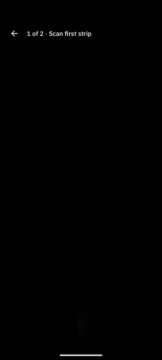
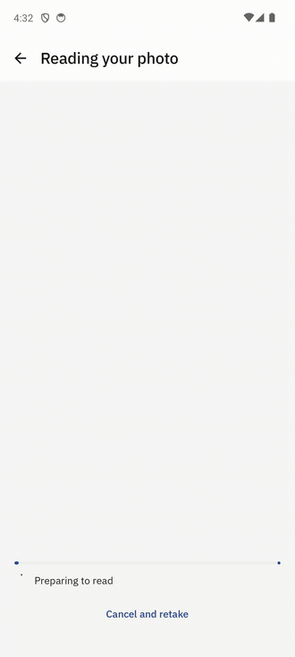
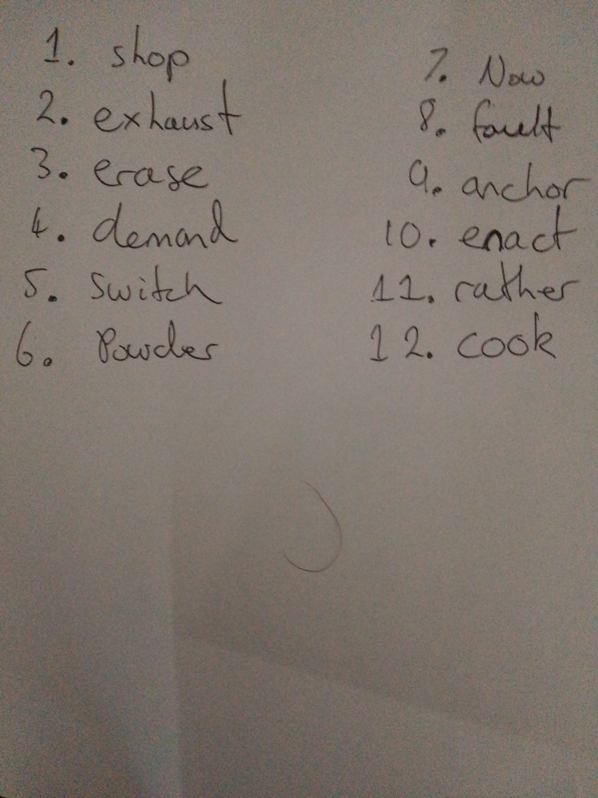
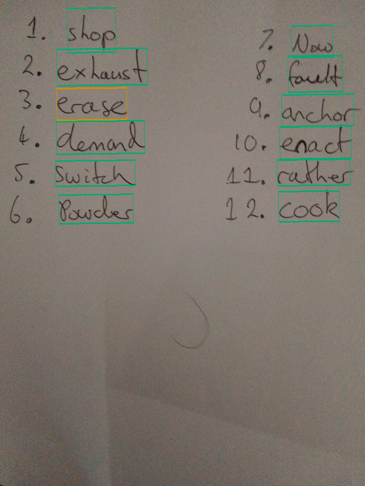

# Bitcoin Vision

Bitcoin data ends up written out by hand: a recovery phrase on a card, a share
of one on a paper strip in a safe. Getting it back into software means typing
it out again, or printing a QR code beside it and hoping that survives too.
Bitcoin Vision reads the handwriting itself, from a photograph, offline, with
no network anywhere in the pipeline.

It is two model pipelines and the Rust that runs them.

| Pipeline | Reads | Models |
| --- | --- | --- |
| [Penlock shares](docs/pipelines/penlock-shares.md) | a cut worksheet strip: twelve rows of six GF(29) symbols, with the identity code that says which share it is | `cell-reference.onnx`, a 29-way cell classifier |
| [BIP39 word lists](docs/pipelines/bip39-words.md) | a handwritten English recovery phrase, numbered or not, in any column layout | `word-detector.onnx`, `text-recogniser.onnx` and its dictionary, `word-reference.onnx` and its calibration |

Each linked document describes that pipeline's stages, what it returns and
where it fails. Neither is the point of the repository; they are what it has.

## Penlock shares

[Penlock](https://penlock.io) splits a BIP39 seed phrase into three shares with
a printable paper wheel and no electronics. Any two recover the phrase; one on
its own says nothing about it. This pipeline reads a photographed strip back:
it finds the strip — by the shaded checksum boxes upstream's original worksheet
prints, or by the corner fiducials and identity code of the registered one —
cuts the card into one image per symbol, and
returns a distribution over the 29 symbols for each — never a letter it is not
entitled to be sure of. A per-word checksum catches a hand's slip on recovery.

<p align="center">
  
</p>

Those are two of the real shares this project's test data was written on — by
hand, on upstream's original worksheet, cut and photographed on a table — put
in front of an emulator's camera. It plays faster than real time, as the other
animation does, because how long an emulator takes over a photograph is not
what is being shown. The recovered phrase never appears: two shares in, a key
fingerprint and which strips made it out.

The implementation is `example-android-app/rust/penlock-scan` (photograph to
symbols) and `example-android-app/rust/penlock` (the arithmetic, and the wheel
the paper version is). Both are plain Rust crates in this repository.
[How it works](docs/pipelines/penlock-shares.md).

## BIP39 word lists

A phrase written out by hand, photographed, turned back into ordered words with
the evidence for each: the polygon it was read from, the exact crop both models
saw, the literal OCR text, a probability for every one of the 2048 words, the
branch that chose, and whether the assembled phrase checksums.

<p align="center">
  
</p>

That is the Android example reading the example page included with it, recorded
on an emulator — which takes far longer over a page than a phone does, so the
reading plays faster than real time and the review after it plays at its own.
[How it works](docs/pipelines/bip39-words.md).

## Using the word-list library

The root `bitcoin-vision` crate is the BIP39 word-list pipeline. The Penlock
pipeline is not behind this API; it is the two crates named above, in the app's
own workspace.

This repository contains the required ONNX models. Use the `bundled-models`
feature with a local path or version-pinned Git dependency; there is no runtime
download or network service. The repository is
`https://github.com/penlock-io/llscan`. The approximately 24.7 MB model
set makes a small crates.io package a separate distribution decision, not
something achieved by hiding the models at runtime.

```rust,no_run
use bitcoin_vision::{Scanner, ScanOptions};

# fn main() -> Result<(), Box<dyn std::error::Error>> {
let scanner = Scanner::bundled()?; // load once, reuse for multiple images
let photo = std::fs::read("handwritten-words.jpg")?;
let result = scanner.scan(&photo, ScanOptions::default())?;
let document = result.document();

for &index in &document.ordered_observations {
    let word = &document.observations[index];
    // word.selected, word.quad, word.candidates and word.selection
    // Do not log wallet phrases in production.
}
# Ok(())
# }
```

For externally managed model files, use `Scanner::new(ModelBytes { .. })`.
The five artifact fields are detector, classifier, calibration, recogniser and
dictionary. Classifier calibration is checked against the model digest and
preprocessing contract. The default build enables ONNX but does not embed model
bytes; `bundled-models` embeds the files included in this repository.

## See the result

One real phone capture, followed by the scanner's returned boxes:

| Input photograph | Actual scanner output |
| --- | --- |
|  |  |

The ordered output is `shop exhaust erase demand switch powder now fault anchor
enact rather cook`. This example's checksum passes. It is a demonstration, not
an accuracy benchmark. Green means native confirmation was accepted; amber means
review is required. Neither color is a ground-truth correctness assertion.

The phrase is a throwaway made for testing. The included full-resolution
[example photo](examples/photos/handwritten.png) has no EXIF or device
metadata; the README images are reduced for display only, and the scanner reads
the full photograph.

Reproduce the example from this repository:

```sh
cargo run --release --features bundled-models --example scan -- \
  examples/photos/handwritten.png new-output-directory
```

The example writes a metadata-free canonical `photo.png`, self-contained
`overlay.svg` with numbered words, display-only `preview.png` and `overlay.png`,
exact recognition `crops/` and structured `result.json`. It refuses to overwrite
an existing output directory. The two PNG previews reproduce the README images.
Replace the input path to scan your own image; no private research corpus is needed.

For example, the first observation's selected word is `shop`, its literal OCR
read is `shop`, and its classifier probability for that word is about `0.9907`.
The JSON also includes the photo-coordinate quad, all 2048 candidates, selection
reason and ordering evidence. Every `hybrid_score` here is null because the OCR
read was itself a BIP39 word, so the exact-text branch took it and ranked
nothing; a null score is an unscored candidate, not a zero.

## Coordinates and decisions

Polygons refer to the canonical image after EXIF orientation is applied once,
and `decode_image` hands back that same frame for display. The final polygon is
the crop both models read, with no added padding. Every classifier candidate is
retained, `probability` is a model probability and `hybrid_score` is not one,
and checksum validity never selects a reading order. `document()` projects
decisions already made rather than running anything again; `diagnostics: true`
adds the traces behind them. The [pipeline
document](docs/pipelines/bip39-words.md) covers the rest.

## Safety and limitations

**Where the three shares are kept is the whole security argument.** One Penlock
share reveals nothing about the seed; any two recover it completely. Two shares
in one place is one place holding the seed.

**Check a recovered phrase against the paper.** Neither a confident reading nor
a valid BIP39 checksum establishes correct recognition — a twelve-word phrase
carries four checksum bits, so one wrong word still passes about one time in
sixteen. Penlock's per-word checksum catches a slip in a single symbol and says
so rather than silently correcting it; nothing catches a word the classifier was confidently wrong about except a
person reading the paper.

English BIP39 is the only vocabulary here; this is not generic handwriting OCR.
Low contrast, ambiguous letters, unusual layouts and missing strokes all cause
mistakes.

Photographs, exact crops and JSON results can hold the entire secret, and
callers own their storage and deletion. Nothing is logged, nothing is uploaded,
and no wallet is created, restored or contacted by these crates.

## Models and licensing

Project code and project-authored models are available under either
[MIT](LICENSE) or [Apache-2.0](LICENSE-APACHE), at your choice.
The [Paddle/RapidOCR models](models/README.md) remain **Apache-2.0-only**;
retain their license and attribution when redistributing them. Dependencies
and the Android app's fonts retain their own licenses and notices.

## Build and test

```sh
cargo test --locked --all-features
cargo test --locked --features bundled-models --example scan
cargo check --locked --no-default-features
cargo doc --locked --no-deps --features bundled-models
```

Tests use synthetic algorithm fixtures and the bundled model artifacts, never
the private training or scan corpus. The lockfile records the dependency graph
used for verification. A downstream Git dependency uses the downstream lockfile;
commit that lockfile to pin its complete graph as well as the crate revision.

This local candidate remains `publish = false`. Its inherited lockfile contains
yanked `chacha20 0.10.1`; the release review must address that without silently
mixing a dependency upgrade into the extraction comparison.
